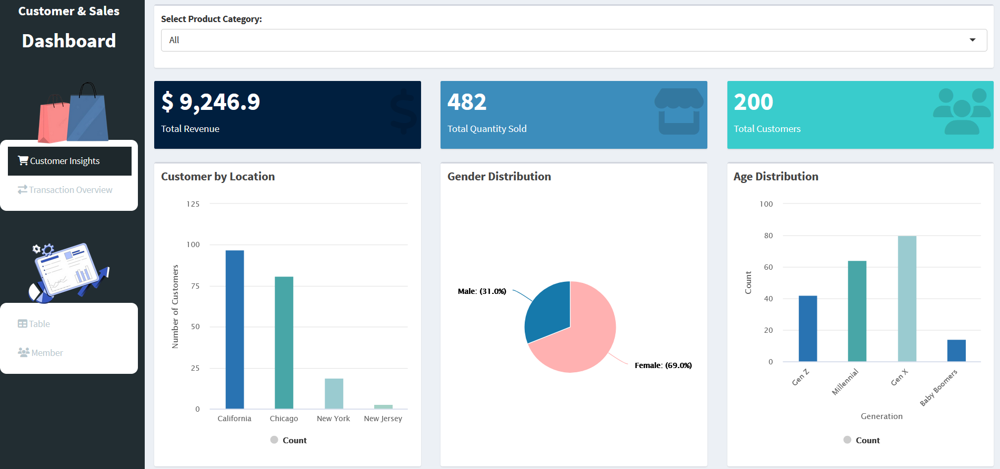
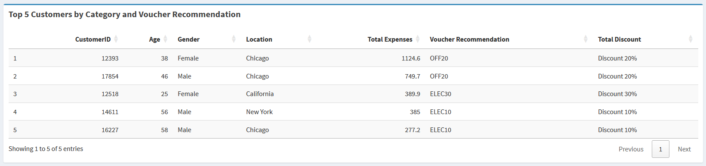
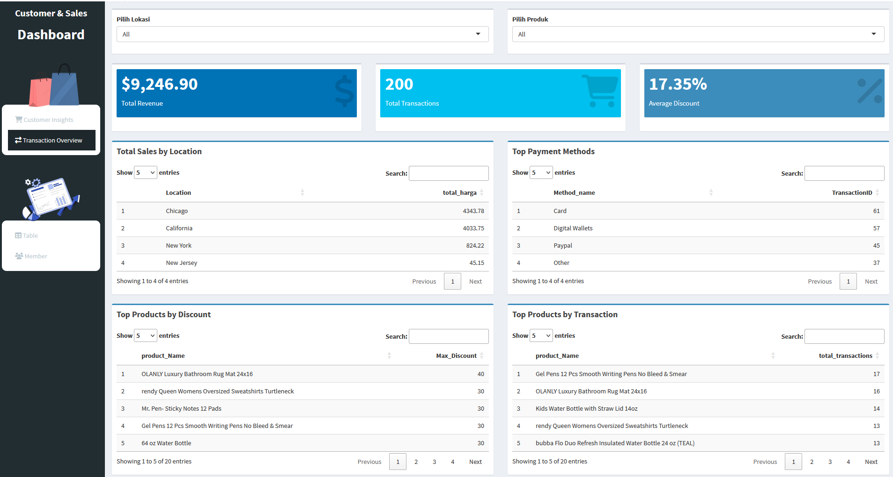
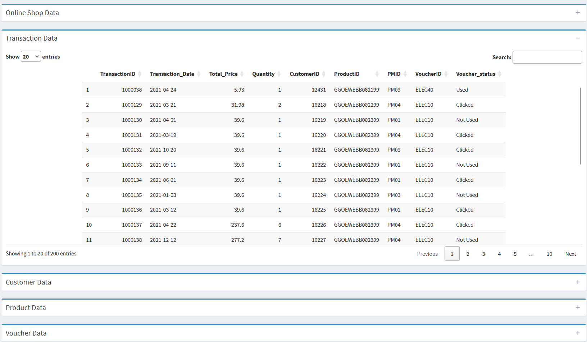
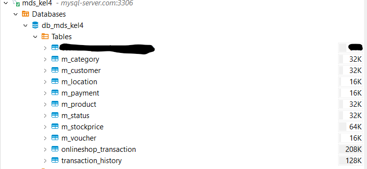

 
 <h2 align="center">Smart CRM, Smarter Sales – Your Customers, Our Priority!</h2>
 
Manfaatkan Analitik untuk Meningkatkan Loyalitas dan Kepuasan Pelanggan Bersama Kami!

  

    
    
     
     
  

  

Tertarik dengan Project Kami? Segera <a href="https://www.paypal.me">Kontak Kami!</a> Maka Kami akan buatkan insight untuk Anda!

## **⭐ Fitur Utama** <!-- omit in toc -->

- [Customer Insight](#customer-insight)
    - [Demografi Customer](#demografi-customer)
    - [Rekomendasi Voucher berdasarkan Total Expense Customer](#voucher-customer)
- [Transaction Overview](#transaction-overview)
    - [Total Sales & Top Payment](#total-sales)
    - [Top Products](#top-product)
- [Screenshoot](#screenshoot)
- [View Demo](#demo)
- [:sparkling\_heart: Interested? Contact Us!](#contact-us)

## **🔥 Highlight Penting!** <!-- omit in toc -->

> [!IMPORTANT]\
> **APA ITU CRM?**
> Customer Relationship Management (CRM) adalah strategi/teknologi yang digunakan untuk mengelola hubungan dengan pelanggan secara efektif. CRM mencakup proses pengumpulan, analisis, dan pemanfaatan data pelanggan untuk meningkatkan pengalaman dan loyalitas pelanggan, sehingga dapat meningkatkan penjualan.

> [!IMPORTANT]\
> **KENAPA CRM PENTING?**
> - **Meningkatkan Loyalitas Pelanggan**  
>  CRM membantu memahami pola perilaku pelanggan melalui data transaksi dan interaksi dengan produk. Sehingga perusahaan dapat memberikan diskon atau menawarkan paket bundling sebagai program loyalitas pelanggan.
> - **Personalisasi Rekomendasi kepada Pelanggan**  
>  Sistem CRM dapat menganalisis preferensi pelanggan berdasarkan riwayat pembelian dan interaksi sebelumnya. Sehingg perusahaan dapat memberikan rekomendasi produk yang relevan dan mengirimkan email pemasaran yang disesuaikan.
> - **Pengambilan Keputusan Berbasis Data**  
>  Dengan fitur analitik CRM tersebut perusahaan dapat memantau tren pasar, menganalisis efektivitas kampanye pemasaran, serta memprediksi kebutuhan pelanggan di masa depan. 

### Customer Insight
Memberikan insight dan membantu menganalisis kebutuhan pelanggan berdasarkan sebaran demografi dari Customer Anda!

#### Overview Demografi Customer
Visualisasi demografi pelanggan (seperti: `Sebaran Pelanggan berdasarkan Area Lokasi`, `Sebaran Pelanggan Berdasarkan Gender`, `Sebaran Pelanggan Berdasarkan Usia/Generasi`).

Anda bisa mendapatkan informasi sebaran pelanggan yang membeli kategori produk: `Home Furniture`, `Apparel`, `Bottle` dan `Office`.

#### Analisis Rekomendasi Voucher
Visualisasi detail pelanggan yang masuk ke dalam top 5 `Total Expenses` terbanyak dan voucher rekomendasi yang diberikan berdasarkan kategori: `Home Furniture`, `Apparel`, `Bottle` dan `Office`.

Anda bisa mendapatkan rekomendasi pemberian voucher spesifik kepada pelanggan yang memiliki behavior melakukan pembelian dengan total expense tertinggi berdasarkan kategori produk.

### Transaction Overview
Memberikan insight dan membantu menganalisis `Total Sales`, `Top Payment`, `Top Products by Discount` dan `Top Products by Transactions`

### **:camera: SCREENSHOOT** <!-- omit in toc -->

- Detail Data
  

  

### **:card_file_box: View Demo** <!-- omit in toc -->

Berikut link shinnyapps atau contoh website Kami : [https://putriniss.shinyapps.io/CRM-MDS-Kel4/]

## **:exclamation: Detail Project Website**
### **Packages** <!-- omit in toc -->
- Package yang Kami gunakan adalah: `shinny`, `shinydashboard`, `ggplot2`, `DT`, `scales`, `tidyr`, `leaflet`, `readr`, `stringr`, and `dplyr` from package R.

### **Connection** <!-- omit in toc -->
- Koneksi yang digunakan adalah koneksi bersama menggunakan DB Open-Source (Free): `clever-cloud.com`

:eyes: Detail Connection

### **Entity Relationship Diagram (ERD)** <!-- omit in toc -->
- ERD yang dibuat berdasarkan data insight yang dibutuhkan

:eyes: Detail ERD

### **:heavy_check_mark: Data Description**
- Data berasal dari 5 entity dinormalisasikan menjadi 10 entity berdasarkan ERD di atas. Hal ini bertujuan untuk memudahkan pembuatan insight dashboard sesuai kebutuhan spesifik, agar meminimalisir resiko data redundan. (Total data observasi: 200 rows)

| Entity                     | Description                   | Attribute                    		                                              |
|:---------------------------|:------------------------------|:-------------------------------------------------------------------------------  |
|m_category                  | Kategori Produk Furnish, dsb  |CategoryID, Product_Category                                   		                    |
|m_customer                  | Gender, Usia Customer         |CustomerID, Gender, Locations, Age, Created_at, LocID               |
|m_location                  | Nama kota, area membeli       |LocID, Loc_Name	             |	
|m_payment                   | Metode pembayaran             |PMID, Method_name          		                            |
|m_product 	                 | Detail Produk	                |ProductID, Product_Name, Product_Description, CategoryID		           |
|m_status 		    	            | Status voucher                |statusID, Voucher_status             |
|m_stockprice                | Stok ketersediaan produk      |ProductID, Product_Name, Product_Description, Product_Category, Stock, Price, CategoryID, StockID     | 
|m_voucher                   | Detail Voucher                |VoucherID, voucher_Name, Discount	           | 	
|onlineshop_transaction      | Data transaksi customer       |-terlampir pada gambar ERD-           | 
|transaction_history         | Data pembelian product        |transactionID, transaction_date, CustomerID, productID, quantity, voucherID, price, discount, total_price, method_name, voucher_status, pmid, statusvc_id|	

<a href="https://putriniss.shinyapps.io/CRM-MDS-Kel4/">View Demo</a>
     

# **:heavy_heart_exclamation: Our Team (GROUP-4)**

- [Muhammad Syafiq](https://github.com/muhammadsyafiq11)       (M0501241005)
- [Riza Rahmah Angelia](https://github.com/rizarangelia)       (M0501241008)
- [UNIQUE DESYRRE A. RESILOY](https://github.com/uniqueeee777) (M0501241025)
- [Panji Lokajaya Arifa](https://github.com/panjiarf4)         (M0501241036)
- [Putri Nisrina Az-Zahra](https://github.com/zhrnisrina)      (M0501241050)

