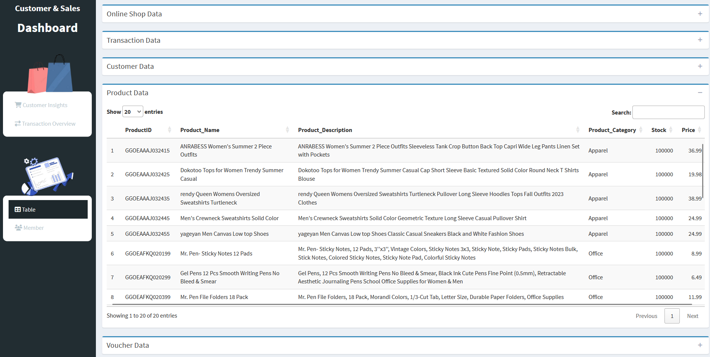

<p align="center">
 
 <h2 align="center">Smart CRM, Smarter Sales – Your Customers, Our Priority!</h2>
 <p align="center">Manfaatkan Analitik untuk Meningkatkan Loyalitas dan Kepuasan Pelanggan Bersama Kami!</p>
</p>
  <p align="center">
    <a href="https://github.com/panjiarf4/Kelompok-4-MDS/graphs/contributors">
      
    </a>
    <a href="https://github.com/panjiarf4/Kelompok-4-MDS/issues">
      
    </a>
     <a href="https://github.com/panjiarf4/Kelompok-4-MDS/issues">
      
    </a>
    <a href="https://github.com/panjiarf4/Kelompok-4-MDS/pulls">
      
    </a>
    <br />
    <br />
    <a href="https://shiny.posit.co">
  
</a>
  </p>
    <p align="center">
    <a href="#all-demos">View Demo</a>
    ·
    <a href="https://github.com/anuraghazra/github-readme-stats/issues/new?assignees=&labels=bug&projects=&template=bug_report.yml">Report Bug</a>
    ·
    <a href="https://github.com/anuraghazra/github-readme-stats/discussions/new?category=q-a">Ask Question</a>
  </p>

<p align="center">Tertarik dengan Project Kami? Segera <a href="https://www.paypal.me/anuraghazra">Kontak Kami!</a> Maka Kami akan buatkan insight untuk Anda!</p>

## **⭐ Fitur Utama** <!-- omit in toc -->

- [Behavior Based Segmentation](#behavior-based-segmentation)
    - [Overview Demografi Customer](#overview-customer)
    - [Analisis Perilaku Transaksi Pelanggan](#analisis-transaksi)
    - [Segmentasi Pelanggan](#segmentasi-pelanggan)
    - [Segmentasi Voucher Berdasarkan Pelanggan](#segmentasi-voucher)
- [Automated Campaigns](#automated-campaigns)
    - [Tools Campaign](#campaihn)
    - [Demo](#demo)
- [Screenshoot](#)
    - [Screenshoot](#usage-1)
    - [Demo](#demo-1)
- [:sparkling\_heart: Interested? Contact Us!](#contact-us)

## **🔥 Highlight Penting!** <!-- omit in toc -->

> [!IMPORTANT]\
> **APA ITU CRM?**
> Customer Relationship Management (CRM) adalah strategi/teknologi yang digunakan untuk mengelola hubungan dengan pelanggan secara efektif. CRM mencakup proses pengumpulan, analisis, dan pemanfaatan data pelanggan untuk meningkatkan pengalaman dan loyalitas pelanggan, sehingga dapat meningkatkan penjualan.

> [!IMPORTANT]\
> **KENAPA CRM PENTING?**
> - **Meningkatkan Loyalitas Pelanggan**  
>  CRM membantu memahami pola perilaku pelanggan melalui data transaksi dan interaksi dengan produk. Sehingga perusahaan dapat memberikan diskon atau menawarkan paket bundling sebagai program loyalitas pelanggan.
> - **Personalisasi Rekomendasi kepada Pelanggan**  
>  Sistem CRM dapat menganalisis preferensi pelanggan berdasarkan riwayat pembelian dan interaksi sebelumnya. Sehingg perusahaan dapat memberikan rekomendasi produk yang relevan dan mengirimkan email pemasaran yang disesuaikan.
> - **Pengambilan Keputusan Berbasis Data**  
>  Dengan fitur analitik CRM tersebut perusahaan dapat memantau tren pasar, menganalisis efektivitas kampanye pemasaran, serta memprediksi kebutuhan pelanggan di masa depan. 

### Behavior Based Segmentation

Copy and paste this into your markdown, and that's it. Simple!

#### Overview Demografi Customer

Visualisasi demografi pelanggan (seperti: `Customer by Location`, `Gender Distribution`, `Age Distribution`).


Anda bisa mendapatkan informasi sebaran pelanggan yang membeli produk berdasarkan lokasi, gender dan usia pelanggan.


#### Analisis Perilaku Transaksi Pelanggan



Anda bisa mendapatkan informasi Analisis data transaksi, customer, kategori produk, dan voucher.


#### Segmentasi Voucher Berdasarkan Pelanggan

Kami menganalisis hubungan produk, pembayaran, dan penggunaan voucher.
```md

```

<details>
<summary>:eyes: Show example</summary>


</details>


## **:camera: SCREENSHOOT** <!-- omit in toc -->

- Transaction Overview
  <p align="center">
  
</p>

- Top 5 Customer
<p align="center">
  
</p>

## **:card_file_box: Demo** <!-- omit in toc -->

The link of our shinnyapps or dashboard project : [https://putriniss.shinyapps.io/CRM-MDS-Kel4/]


## **:exclamation: Packages**

- The Dashboard are `shinny`, `shinydashboard`, `ggplot2`, `DT`, `scales`, `tidyr`, `leaflet`, `readr`, `stringr`, and `dplyr` from package R.

## **:heavy_check_mark: Data Description**

Data terdiri dari 14 peubah dengan 1730 observasi

| Attribute (Peubah)         | Type                  | Description                     		                                              |
|:---------------------------|:----------------------|:-------------------------------------------------------------------------------  |
| price_in_rp                | numerik               | Harga properti dalam satuan Rupiah.                       		                    |
| address                    | factor	               | Alamat lengkap properti yang mencakup nama kompleks, jalan, atau area spesifik.  |
| district                   | factor		             | Nama kecamatan atau wilayah tempat properti berada, tanpa detail alamat lengkap. |	
| city                       | factor		             | Nama kota tempat properti berada.                 		                            |
| lat	                       | numerik		           | Koordinat garis lintang lokasi properti dalam sistem geografis.	                |
| long		    	             | numerik               | Koordinat garis bujur lokasi properti dalam sistem geografis.                    |
| Total Luas                 | numerik               | Menunjukkan ukuran tanah properti dan luas area bangunan.                        |
| carports                   | numerik		           | Jumlah carport (tempat parkir mobil tanpa garasi) yang tersedia.                 |	
| electricity                | factor		             | menunjukkan daya yang dapat digunakan.                 		                      |
| floors	                   | numerik		           | Menunjukkan tingkat vertikalitas properti.                      	                |
| property_condition		     | factor                | Kondisi properti saat ini.                                                       |
| building_orientation       | factor                | Arah orientasi bangunan, seperti "timur", "barat", atau "selatan".               |
| garages                    | numerik	             | Jumlah garasi yang tersedia untuk kendaraan.                                     |
| furnishing                 | factor		             | Tingkat kelengkapan interior rumah.                                              |	

# **:heavy_heart_exclamation: Our Team**

- [Muhammad Syafiq](https://github.com/muhammadsyafiq11) (M0501241005)
- [Riza Rahmah Angelia](https://github.com/rizarangelia) (M0501241008)
- [UNIQUE DESYRRE A. RESILOY](https://github.com/xx](https://github.com/uniqueeee777) (M0501241025)
- [Panji Lokajaya Arifa](https://github.com/panjiarf4) (M0501241036)
- [Putri Nisrina Az-Zahra](https://github.com/xx](https://github.com/zhrnisrina) (M0501241050)


